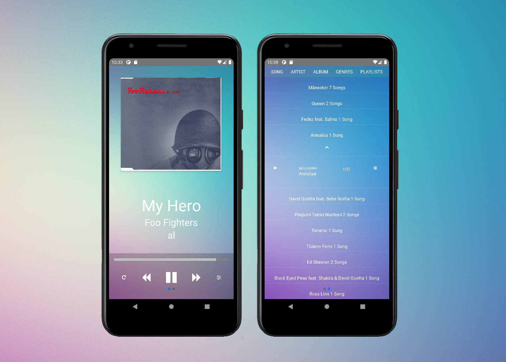

# Mix.app

<h1>A React-Native media player application</h1>

Currently UI only, but will have actual media playback

<h2>To Do</h2>
<ul>
    <li>settings popup </li>
    <li>progressbar functionality</li>
    <li>handle folders in music directory</li>
    <li>read metadata from files</li>
    <li>rewind/adjust position</li>
</ul>

# 